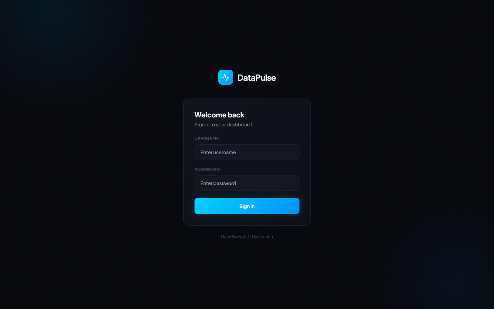
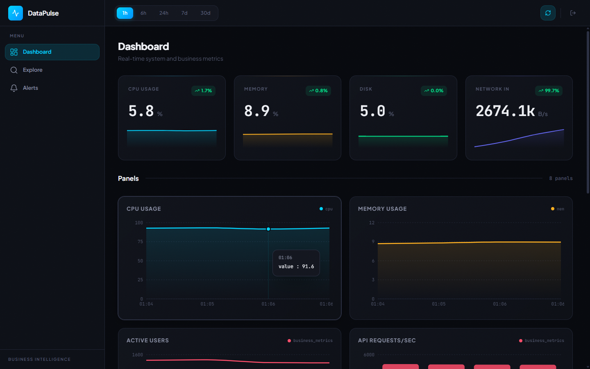
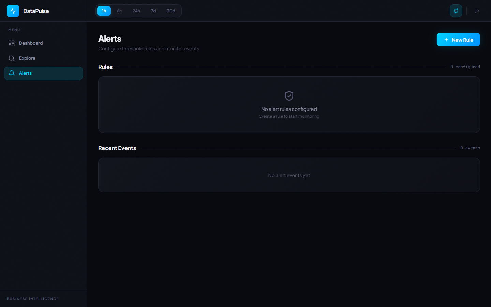

# DataPulse

Open source self-hosted business intelligence dashboard by DavnsTech. Consumes Telegraf metrics via InfluxDB and renders real-time charts, KPIs, trends and alerts.

## Preview

**Login**



**Dashboard — KPI cards & chart panels**



**Alerts — threshold rules & event monitoring**



## Features

- Real-time KPI cards with sparkline trends
- Configurable dashboard with multiple chart types (area, line, bar)
- Explore page with query builder for ad-hoc metric exploration
- Alert rules with threshold-based evaluation
- JWT authentication
- Business metrics simulation for demo purposes
- Enterprise dark theme UI built with Tailwind CSS and Recharts

## Tech Stack

- **Backend:** Java 21, Spring Boot 3.3, InfluxDB 2.x client
- **Frontend:** React 18, TypeScript 5, Vite, Tailwind CSS, Recharts
- **Data:** Telegraf → InfluxDB 2.x
- **Deploy:** Docker Compose

## Quickstart

```bash
git clone https://github.com/DavnsTech/datapulse-dashboard.git
cd datapulse-dashboard
docker compose -f docker-compose.prod.yml up --build
```

Open http://localhost in your browser. Login with `admin` / `admin`.

## Development

**Backend:**

```bash
# Start InfluxDB and Telegraf
docker compose up influxdb telegraf

# Run Spring Boot
./mvnw spring-boot:run
```

**Frontend:**

```bash
cd frontend
npm install
npm run dev
```

Frontend runs at http://localhost:5173 with API proxy to :8080.

## Configuration

| Variable | Default | Description |
|---|---|---|
| `INFLUXDB_URL` | `http://localhost:8086` | InfluxDB connection URL |
| `INFLUXDB_TOKEN` | `datapulse-dev-token` | InfluxDB API token |
| `INFLUXDB_ORG` | `datapulse` | InfluxDB organization |
| `INFLUXDB_BUCKET` | `telegraf` | InfluxDB bucket |
| `JWT_SECRET` | dev default | JWT signing secret (min 32 chars) |
| `AUTH_USERNAME` | `admin` | Login username |
| `AUTH_PASSWORD` | `admin` | Login password |

## Adding Custom Metrics

1. Add a Telegraf input plugin in `telegraf/telegraf.conf`
2. Restart Telegraf
3. New measurements appear automatically in the Explore page
4. Add panels to dashboards via the dashboard config API

## License

MIT
